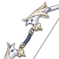

# Amber


This guide was written by Hatsuharufag\#4291 of [Amber Mains](https://discord.gg/fTDtAVzfR6)! You can find the full document [here](https://docs.google.com/document/d/1l132T12qme-0xMtY7Ff5JIS2N1sZqGoA3InCHkbvQlU/edit#).


## Preface

> Outrider Amber! Reporting for duty! Just say the word if you ever need my help!

   

   A lot of people think that Amber is a “joke” character. Good for overworld exploration but bad in actual combat. This is not necessarily true, and the purpose of this document is to explain why.

   To start with, Amber is not a character for everyone. To use her means to get good at using Aimed Mode mechanic, utilizing either Charged Shot or Quick Shot attacks. While any other character but Ganyu can be just key mashed to victory, Amber needs that extra control and effort to function. No buts, no ifs. In large part her reputation as a bad character is due to this unfortunate requirement. 

   Amber is not a support character. Trying to use her as a support is like trying to use Razor as a support. It is certainly possible, but there are much better options out there. This is the other reason her potential is regarded as lacking. That being said, Amber IS a support character in early-to-mid stages of the game for overworld exploration purposes due to her exceptional utility.

   Amber is a pure breed carry, with a certain gimmick letting her push way above her implied weight class. Hits on weakspots count as auto-crit, letting you stack Crit Damage with reckless abandon completely disregarding Crit Rate. And this is on top of Melt and Elemental Mastery amplifying damage even further beyond. This makes her quite a lethal “joke” character in the right hands.

**Pros:**

* One of the best thighs in the game
* Her Vision is Pyro giving her access to better elemental reactions
* DPS against a single target with a weakspot is in Ganyu/Xiao/Diluc big boi range
* You get her for free in the first 5 minutes of playing the game
* Cons do not matter, she’s pretty much as strong at C0 as she is at C6
* Can use two 3☆ bows that are better in her hands then 4☆ bows
* Has artifact set perfectly tailored to her strengths, Wanderer’s Troupe
* Best Cryo shield breaking in the game

**Cons:**

* You will have to use Aimed Mode whether you like it or not
* Not all monsters have weakspots
* Farming Wanderer’s Troupe artifacts is prohibitively expensive
* Getting cons is even more prohibitively expensive
* Dismal AoE damage
* Needs a comp build specifically around her 
* You will have to get good at Aimed Mode whether you like it or not

## Chapter I

### Character Breakdown

> My vision... is a sign that Archons believe in me!

   Fundamentally, Amber is quite a simple character to play. Alas, the game does a poor job at explaining how to manage that. 

   Amber’s game plan is just to dish out as many attacks as possible using Aim Mode. Her Elemental Skill is a utility tool to manage enemy aggression. Her Elemental Burst is AoE damage ability to help a bit in crowded situations, albeit not by much. 

   The notion that she’s a “joke” comes from trying to use her extremely weak normal attacks, trying to use her Elemental Skill as a damage source instead of utility tool, or relying on her Elemental Burst to do damage without knowing how it works, as it is not a simple fire and forget ability.

   These are also the main reasons why trying to force Amber into a support role will not work. She, as a character, and her kit are designed around Aim Mode. There will be no real utility value to the team, as she is designed to be on the field with team supporting her.

   This must be clearly understood before trying to do anything with Amber. She is a character that will:

* spend the vast majority of the time on field;
* do the bulk of the damage for the team;
* be the one with the highest investment level

   There is no way around that. Given the amazing output Amber provides other characters in the party act like accessories amplifying her personal damage, and not the other way around.

   That being said, Amber is a perfectly fine support for Abyss when you need a Pyro unit to break Cryo shields. Abyss forces us to use characters of certain elements to break elemental shields/armor and a lot of the time we just don’t have enough characters that we invested in. Amber is exceptional at breaking Cryo shields and armor due to her ult having high application rate of Pyro and also having access to strong Pyro application at will using charged shots. Remember though that in order to do her job support Amber DOES NOT NEED TO BE LEVELED. Shield breaking effectiveness does not depend on neither damage nor levels. Just throw your level 20 Amber with random artifacts when you have to, just make sure she does not die.

### Normal and Charged Attacks

> I'll share my ultimate secret with you! The most important thing to remember, is to have courage!

**Normal Attacks**

* Do not use them if you can help it
* I mean it

   Amber has one, if not the, worst normal attacks in the game. They do not apply any element, they can only hit a single target, they do not apply any stagger, and they have extremely lacking damage output. Ignore Amber’s normal attacks, think that they do not exist.

**Charged Attack**

* Main source of damage output
* Two different modes, doing either PHYS or Pyro DMG
* Fully Charged Shot applies 2U of Pyro
* Can be guaranteed to crit with zero investment into Crit Rate
* Hard to use, even harder to master

   ****The bread and butter of Amber gameplay. You will have to get good at aiming, get good  at shooting weakspots, will have to learn intricacies of the animation cancels, or you will not have fun playing Amber. This is the last time you are warned that playing Amber is not for the faint of heart. 

#### Overview

   For starters, there are two distinctively different attacks that you can launch. Quick Aimed Shot, that is very spammable, takes little time to execute, and deals mediocre physical damage. Or fully Charged Shot, that takes time to charge, must not be interrupted mid-charging, and deals a high amount of Pyro damage. 

   _Any hit with those two attacks on a weakspot will be a guaranteed critical._ Crit Rate does not impact damage done in any feasible way when hitting weakspots, essentially think your Crit Rate is set to 100% at the cost of high skill requirement. This is what lets Amber go completely ballistic with Crit Damage investment and get away with it. Not gonna lie or sugarcoat things, consistently hitting a small target like a head mounted on moving target like a Fatui Skirmisher requires some practice. You’re not going to do it on your first or second or even third try. Practice makes perfect. 

   Charged attacks do not operate on any resource like stamina or energy nor do they have any cooldowns that prevent you from using them in succession, making it a reliable way of high damage, sustained, single target output.

#### Baes Mechanics

   Both these attacks can be launched in 2 different ways, by holding Attack button, or by manually entering Aim Mode and attacking from it.

   Aim Mode is easier to use, but it has unfortunate side effect. The reloading animation takes about extra 0,3 seconds for each shot. That’s time wasted doing nothing. You can cut this animation by leaving Aim Mode and rapidly re-entering it.

   Holding Attack button completely skips reload animation, significantly reducing workload required for maximizing amount of arrows shot at the enemy. The Attack button must be held for at least 251ms for the game to trigger the Quick Aimed Shot attacks, and must be held for another ~1000ms on top for the game to trigger fully Charged Shot.

   Any source of damage boost that states that it increases Charged Attack damage buffs the damage of both Quick Aimed Shot and fully Charged Shot. Bloodstained Chivalry 4p set bonus, Martial Artist both 2p and 4p set bonuses, Abyss cards to name a few sources, they all increase the damage done by both types of Amber’s Charged Attacks. 

#### Advanced Mechanics

   The attack button can be released as soon as any of the above conditions are met, and the desired type of attack will be launched. The Next attack can be queued right after you release, without waiting for any downtime.

    You do not have to wait for the start-up frames to fully play to launch an attack. They notoriously lag behind the actual timing when it becomes possible to launch the attack. Sound cue is immensely helpful in releasing fully Charged Shot earlier than it looks to be possible.

   The wind down frames can be skipped by double tapping Aim Mode button at the right time. Quick Aimed Shots can be launched, utilizing all the above techs, at frame perfect play, visually without entering Aim Mode at all. This provides MV/s output above Keqing N1C, but realistically you can’t reach the full potential without becoming a god. In mortal hands this output requires you to fully macro the rotation, and due to MHY stance on macro it might not be the wisest decision.

### Elemental Skill

> Baron Bunny hails from a storied lineage, but Amber has stopped keeping count after Baron Bunny the 893rd

#### 

#### Baron Bunny:

* Continuously taunts nearby enemies, drawing fire
* When destroyed or when duration expires, Baron Bunny explodes dealing AoE Pyro DMG
* Applies 2U of pyro to targets hit by explosion
* Tapping E will throw it right in front of the character
* Holding E will let you adjust the throw distance and direction
* Damage scales based on Amber’s ATK
* HP will scale with Amber’s HP
* DEF and RES will directly copy Amber’s DEF and RES

   This ability is not  a source of damage, and neither can it be used to spread Pyro aura effectively. It is almost purely a utility one, tailored to make it easier for Amber to keep the charged game up.

   All taunt abilities in the game share the same taunt AoE. It is equal to Mona and Ganyu elemental skills in this role. 

   Taunt radius is not that large\(see fig.2\), so care must be taken to make full use of it.

   Do note that monsters can not switch targets mid-action. If a monster starts his attack sequence, it will finish the sequence attacking the initial target, even if it was taunted in the middle of that. Monster will switch targets only when in idle stance. 

   A lot of misconceptions that Bunny is a bad ability stem from trying to taunt monsters after they initiated the attack sequence, so keep this in mind. 

   The small taunt radius and comparatively large timing between taunt pulses makes it possible for fast-moving enemies to slip by without ever being taunted. 

   Taunt distance is measured to the direct center of the enemy model, not the closest point. Due to that large bulky monsters might not be taunted, even if visually they seem to be in the effective radius of the Baron Bunny.

   After 8 seconds or after being destroyed, whichever happens first, Baron Bunny detonates, dealing average damage in a small radius around it. Actual hitbox of the explosion does not correlate with the visual effect of it\(see fig.3\). Another problem is passivity of most enemies. Almost all enemies will usually stay right outside of the burst radius even when taunted by the Baron Bunny. They must be actively attacking it melee in order to be hit by detonation. Yet another problem is the relatively low mass that Baron Bunny has. Attacks with knockback effect can throw it far away, once again depriving it of the detonation damage. And unless the explosion damages the enemy, this ability will not generate any elemental particles to recharge energy for the elemental burst.

   At the same time, Baron Bunny being flung around so much can be a hidden blessing, with lucky RNG forcing aggro’ed monsters to take more distance away from you.

   Baron Bunny detonation counts as a “heavy” hit. It shatters frozen enemies and deals very high damage to geo shields, both churl and slime ones.

### Elemental Burst

> Amber’s passion runs truly hot.

#### 

#### Fiery Rain

* Deals damage in 18 pulses staggered over 2 seconds
* Damage dealt is based on enemy position inside the AoE
* Applies 1U of pyro 6 times, roughly every 300ms
* Small area of effect
* Cheap energy cost of 40
* Good at breaking Ice Shields

   Despite boasting high MV of 505% at Talent level 1, this ability is not a simple nuke that deals a listed number. Not every target will be hit 18 times in the area of effect. The area can roughly be divided into 3 zones:

	Dead center — hit 18 times, absolute maximum;

	Inner circle   — hit 12 times,

	Outer circle  — hit 4 times.

   The position of the enemy is dynamically tracked, so if the enemy walks through different zones in the area of effect he can be hit more or less than listed, depending on the time the enemy spent in the zones. It is a very very rough approximation of inner workings of this ability, so take it with a healthy dose of salt.

   Since this ability does damage in waves, Melt and Vaporize can only boost damage of a few hits, diminishing the potential damage output significantly. On the other hand, due to this Fiery Rain is absolutely amazing in breaking enemy elemental shields, breaking cryo shields almost instantly if the target was dead center when ability was cast.   

   For some bizarre reason the ability tracks vertical targets very poorly, enemies elevated above the ground by Geo Constructs might not be hit by Fiery Rain at all, or take limited damage not corresponding to their position in the area of effect.

   This ability has a poor aiming algorithm, meaning it targets the closest enemy to the character when cast. It is almost impossible to target a specific enemy that you want to hit with it if some other enemy is closer. If you want to hit a Cryo Abyss Mage in a pack of Churls, you are forced to dive into the pack and crash yourself on the Mage, making him the closest target, to guarantee that the ability will target him. This might prove problematic.

### Constellations

> Yeah! As fast as a riding wind!

   The only way to get Amber cons is to roll on a standard banner right now. Amber is not in drop pools of limited character banners or weapon banners at all. Getting her cons is very expensive . On average you are ‘likely’ to get one Amber con in 172 rolls of a standard banner. But that’s just a mathematical average. You can get lucky and get multiple Amber cons in that amount of rolls, you might get unlucky and get absolutely nothing but multiple Bells and Rainslashers. 

   \(Un\)Fortunately, Amber cons are not the greatest. At best, they offer a different playstyle. At worst, they are actually detrimental. At C0, typical charge shot focused Amber will do about only 12% less damage then C6 one. 

   C3 and C5 just increase the talent levels of Elemental Burst and Elemental Skill respectively. I do not see any point explaining them in detail.

####   C1. One Arrow to Rule Them All

* Adds extra arrow to any Aimed Mode attack
* Both Quick Aimed Shot and fully Charged Shot benefit from it
* Deals 20% of initial MV 
* Calculated as a separate attack somewhat like a Crescent   Pike
* Extends the flat ballistic trajectory of the main arrow

   Even though on paper it sounds good, in reality it is not. Second arrow disregards damage the main arrow deals completely, it is not a direct 20% damage copy of the first one. Second arrow shares ICD with the main one, meaning it is impossible to melt both. Second arrow sometimes can steal melts from the main one, actually significantly gimping damage output. This is especially noticeable in close quarter combat. Second arrow also flies lower than the first one, making it close to impossible to hit the weakspot of most human-sized characters with both. In a melt setup, it boosts damage output by about 4% at best, and actually decreases output by as much as 60% at worst. 

   On a more positive note, due to this Crescent Pike-esque effect Amber becomes a solid physical damage dealer utilizing Quick Aimed Shots. This is the only scenario where this con is a serious boost in damage output.

####  C2. Bunny Triggered

* Makes it possible to manually detonate Baron Bunny
* Need to hit the ground underneath the Bunny for it to detonate
* Hit must be done with a fully Charged Shot.
* Manual detonation gives 200 DMG% bonus to explosion damage
* Provides some hard-hitting AoE damage that Amber desperately needs
* Both main arrow and C1 extra arrow can detonate it
* Gives Amber some viability as a burst support option

   200 DMG% bonus is additive to all other DMG% bonuses like Pyro Goblet for example. It will not straight up triple the damage of the bunny. 

   It will significantly increase its damage though. Manual detonation makes it one of, if not the hardest hitting Elemental Skill in the whole game. This opens up a chance to run Amber as a burst support or in quickswap teams. Manually detonated and melted Baron Bunny will deal a lot of damage.

   15 seconds cooldown is still a significant downside, so building specifically for Bunny explosion is questionable for a full-time carry Amber. It is a nice bonus, and a welcome one to be sure.

   The con description is misleading. There is no need to specifically target the foot. You only have to hit the ground underneath the bunny, and it will detonate. Fully Charged Shot has a miniscule AoE, so triggering it reliably is easy with some practice. 

   Explosion area of effect does not change compared to normal Bunny explosion. It is quite a small one, so you need to take that into account.

   Another thing to take into account is that you are trading utility for damage. Baron Bunny, even with all his caveats, is still a decent aggro management tool. Just exploding it for damage might be a waste and actually detrimental depending on the combat situation. 

   There is certain advanced tech that lets you manually detonate Baron Bunny without hitting it at all. Overload elemental reaction radiates the properties of attack that triggered it. In other words, if you trigger overload with Amber’s fully Charged Shot, that overload will be able to trigger Baron Bunny explosion. This is extremely handy in AoE scenarios, as one of the few ways for Amber to deal with crowds is relying on overload elemental reaction.

#### 
  C4. It's Not Just Any Doll...

* Adds extra charge to Elemental Skill
* Decreases cooldown of Elemental Skill by 20%
* Cooldown between both charges is shared
* Takes 12 seconds to cooldown 1 charge, or 24 seconds to cooldown both charges
* Significantly increases the viability of Amber as a burst support

   This con is one of the more impactful ones. For the full-time field carry Amber having lower cooldown on her main survivability tool is very handy. Extra charge as a panic button is also quite useful.

  On the other hand, it gives Amber a lot of burst potential. Melting double bunnies is enough to two-shot pretty much anything in the game. Hefty cooldown will not allow you to repeat it in rapid succession though. 

  But even without melting they will still do a very large chunk of damage. Having burst option not tied to energy and only locked behind cooldown is quite a valuable thing to have.   

  12 second cooldown also ties perfectly into Elemental Burst. Essentially it allows you to swap to Amber, explode Baron Bunny, drop Elemental Burst, and leave the field. This combo takes about 3 seconds, and deals respectable amount of damage. Given how easy it is to fuel 40 energy bursts without investing much into ER, it makes Amber decent burst support option, if only controversial.

####  C6. Wildfire

* Using Elemental Burst gives party-wide 15 ATK% and 15% move SPD buff for 10 seconds
* Move SPD buffs are extremely handy for Aimed shot focused Amber
* Further solidifies Amber’s option as a support character

   15 ATK% buff is nice. On average it will increase the team output by circa 6%, assuming you use Elemental Burst every 12 seconds. Built-in lesser version of Noblesse artifact set bonus is certainly nice, but compared to the absolutely mind-blowing stuff other characters get at C6 I can’t help but find it underwhelming. 

   Movement speed buff though is certainly something to write home about. Amber is not a stationary character, she moves a lot kiting monsters, setting up killzones, luring monsters into cryo sources to melt their heads off. Movement speed is godsent for this. Extra mobility for Archer characters can never be underestimated. It is brawler-type characters that do not directly benefit from it so much. 

   This constellation also increases Amber’s value as a support character a bit. Instead of just dumping a lot of damage in a short time frame with Bunny bombing and Fiery Rain spam, just by doing the same thing she was doing before Amber also buffs her whole team. Not by much, not by a significant amount by any means, she’s still a burst support through and through. But it is certainly appreciated. 

   Good luck getting C6 Amber to reap all those benefits. You will need it.

## Chapter II

### Playstyles

   There are two ways to play Amber:

   First — Amber spends all the time on the field shooting her bow as a main source of damage for the party, i.e. “carry” or “main DPS” to put it simply. 

   Second — Amber spends only a few seconds on the field, just to dump her manually detonated Elemental Skill and Elemental Burst for a big spike of damage, and you swap to other character after, i.e. “burst DPS” or “sub-carry”. This is also what you will be doing as support Amber but the focus will be on utility rather than damage.

   First playstyle  is the most fun, and at the same time the hardest way to play Amber. It assumes you will shoot enemies with her bow, and she will be the main character spending all the time on the field and doing 80-90% of the whole party output in damage. Shooting in this game sucks, but you will have to deal with it.

#### Sharpshooter

   Most famous, the definitive Amber playstyle/build, the way devs intended you to play her. You use fully Charged shots to hit enemy weakspots, abusing the fact that they are auto-crits. At the same time, you melt/vaporize these fully Charged shots to further increase the damage. 

   Fully Charged shots have neither cooldown nor any ICD shenanigans, you can keep chaining them for all eternity. This provides a steady and stable source of high single-target damage.

   It is very easy to fuck up aura application orders and instead of melting/vaping fully Charged shot you get a whiff, so patience and prudence are a must. What I mean by that, you should never ever shoot a target if it has no Hydro or Cryo aura pre-applied. Amber’s fully Charged Shot applies strong Pyro aura. Normally it is fully consumed if you melt/vape. If by accident you apply this aura to the monster, it will be very hard to get rid of it and continue melting/vaping. 

   Tag \[melt\] will be used in the rest of the document when referring to this playstyle.

#### Gunslinger

   This one focuses on another part of Aimed mode, quick Aimed Shots. The main point of it is to use animation cancels to shower monsters in arrows. It does not rely on weakspots or melt/vape, just on pure amount of arrows doing physical damage that you chum out.

   It is often used in “Amber solo” showcases, so you might’ve seen it a lot in that kind of videos.  It is not as good at doing damage as properly executed Sharpshooter style, but much harder to fuck up. It also doesn’t rely on other characters in your party, making it easier to build effective teams.

   Tag \[phys\] will be used for the rest of the document when referring to this playstyle.

#### Bunny Bomber

   This one is locked behind cons. You will absolutely need C2.

   Having said that, this is the playstyle of choice if you want to use Amber, but don’t want to deal with the wonkiness of Aimed Mode. Amber is not of the field most of the time. You only swap to manually detonate Baron Bunny and optionally drop her Fiery Rain on top after. Manual detonation, and the boost in damage it provides, is crucial. It is the thing that makes this build/playstyle possible.

   Essentially the purpose of it is to abuse the nuke Amber gets, as with C2 Bunny hits extremely hard. Youtube clickbait videos have shown 350k crits with a single manually detonated bunny. While by no means you will do the same damage, the potential is there. 

   Bunny Bomber builds, due to being locked behind cons, are not used a lot and not well understood as this moment. Most of the work done on them is a theoretical one. 

   Tag \[bunny\] will be used for the rest of the document when referring to this playstyle.

#### Support Amber

   The point of support Amber is to do various tasks in overworld exploration and Abyss.

   Do note that you are not supposed to invest resources to level up Amber or her weapon. Her end-game support capabilities are lacking and her usefulness does not depend or scale with levels.

   First, Amber is a god-tier Pyro unit at shield breaking. To be fair, Bennet is considered better at this job because he also heals and buffs the team but Amber is suitable for the 2nd Abyss team.

   In overworld, having a Pyro unit in your party is pretty much mandatory because Cryo shield is the most common type of shield in the game \(due to the existence of Cryo slimes, Cryo Abyss mages and Cryo Fatui\).

   Second, Baron Bunny is very useful in overworld because he allows you to backstab enemies with directional shields such as Wooden Shield Mitachurl and Rockshield Mitachurl.

   Third, Amber is a Pyro archer which is very useful and sometimes required for solving puzzles in overworld. You can also use Baron Bunny to solve some puzzles with pressure plates \(although some of them require heavier objects such as Geo MC’s boulder\).

   To sum up, Amber has a lot of tools that make your early-to-mid game comfier, saving you a lot of time fighting certain enemies and switching characters around to solve puzzles. That is her purpose as the first free character in the game. However, after the exploration part of the game you either need to discard Amber completely or make her a main carry.

## Chapter III

### Team Building

   As Genshin Impact in large part is a game about building perfect team synergy, it is important to know what characters make it possible to push Amber to her absolute limit.

   In large part all choices will be dictated from the carry Amber perspective. This document’s purpose is to show how Amber can be used and how to support her as a character that spends most of the time on field doing fully Charged Shots or quick Aimed Shots. Some characters are stronger than Amber, and using them just to support Amber limits their potential. This is a controversial take. But such silly notions are beyond a devoted waifufag. 

   With this out of the way, let’s start.

   All characters that Amber uses as supports can be roughly classified in 4 roles. These roles are pretty flexible and one character can fulfil multiple roles all by himself, but usually characters have a side that’s the most desireable one for Amber. Think of these roles as \[tags\] that help you understand the purpose of team members easier rather than some rigid definitions.

* Directly contribute to total team output with their own high damage / \[Damage support\]
* Indirectly contribute to the team output by enhancing damage or survivability of Amber and/or other team members / \[Buff support\]
* Characters that set up Elemental Reactions for Amber to take advantage of / \[Elemental Support\]
* Crowd Control characters that help you manage monsters and set up favourable fights / \[CC Support\]

   There is no perfect team composition. You will fight different enemies in different scenarios. Being adaptive to the situation at hand is more important than adhering to some dogmatic “perfect comp” that does not exist. 

   Not all characters will be mentioned. Some simply do not synergize with Amber at all, and they will be ignored.

#### Damage Supports

   Main role of \[Damage Support\] for Amber is to just deal as much damage off-screen as possible. As it is extremely hard to outmatch Amber’s single target damage, most \[Damage Supports\] would be focused on AoE damage, aiming to cover up Amber’s weak side, which is dealing with crowds of chaff monsters fast and efficiently. 

   As said before, some \[Damage Supports\] offer extra utility, which will be noted.

####  

#### Beidou

*  Main role: \[Damage Support\]
* extra utility: \[Elemental Support\], \[CC Support\]
* Offers excellent AoE damage potential with her Q that Amber can utilize well
* Severe problems with her Q uptime due to energy problems
* Can set up Overload elemental reaction which helps in crowd control
* Can be freely swapped to perform Perfect Counter without hindering Amber’s rotation
* Must be well invested

   Beidou’s Q damage potential, simply put, is monstrous. She’s one of the best AoE damage dealing characters in the game for a very good reason. Her Q fully works with both types of charged shots. In fact, Amber’s quick Aimed Shots are the best launch platform for her Q from all characters in the game due to very fast attack speed. Fully Charged Shot hit on the enemy with Beidou’s Q active will proc an Overload reaction, which deals some echo damage and most importantly provides some very appreciated crowd control. Small enemies will be ragdolled around, which is not a problem for a ranged character. Large enemies will be stunned instead, which is also very helpful. 

   Be mindful that the Q discharge range is not very large. You do not have to hug monsters, but you have to be fairly close to them. Otherwise the chain lightning will not be summoned.

   Since Beidou is usually the only Electro character in Amber’s team, feeding her enough energy for decent Q uptime will be very hard. You will have to specifically invest into both damage and energy recharge when building her. Fortunately you are not punished in any way for switching to Beidou to do a perfect counter and generate particles, so it is not as bad as you might think. 

   All in all Beidou is one of the best \[Damage Support\] characters to add to Amber’s party.

#### Anemo MC

* Main role: \[Damage Support\]
* Extra utility: \[Buff Support\], \[CC Support\]
* Good AoE damage against hordes of weak enemies with both his E and Q
* Some crowd control with his E and Q
* Can shred RES with C6 that you get for free for 10 seconds
* Can shred even more RES when equipped with Viridescent Venerer artifact set
* Must be well invested

   A lot of people think that Anemo MC is weak. Do not be fooled by this notion. Both his E and Q skills over very high AoE damage. Going purely by MV/s they are directly competitive with Venti, and free C6 helps to push him even closer.

   Anemo MC also gets a lot of flack for his Q drawing monsters away from you. Specifically in Amber’s case it is actually a positive effect rather than a negative one, as being surrounded by a horde of weak enemies is not that pleasant for an archer. 

   Anemo MC’s Q will pick up and carry Baron Bunny within it, letting you easily get full explosion value from it. 

   His Q also not picking up and carrying away big monsters is also a blessing in disguise. Big monsters are more often than not come in singles and pairs, letting you easily set up RES shred and start blasting them with Amber without waiting for the tornado to end. 

   Anemo MC, just like all other \[Damage Support\] characters, will have to be well invested. Running him uninvested is certainly possible, as you get full effect from VV and C6 shreds even with +0 weapon and artifacts, but his AoE damage potential will leave much to be desired.

#### 
Venti

* Better version of Anemo MC
* He is bloody Venti
* Do I really need to say more?

   His Q blender does pull large and heavy monsters inside, so accurately sniping their weakspots would be painful. There is nothing else to say, most Anemo MC stuff applies to Venti as well. 

#### Mona

* Main role: \[Damage Support\]
* Extra utility: \[Elemental Support\], \[CC Support\]
* Good AoE damage with her Q
* Amber easily set up perfect Q one-shot combo for Mona
* Mona’s E performs double duty as a crowd control and hydro aura applicator
* Must have decent invested

   Mona and Amber play well together. Mona’s E keeps applying hydro over time on top of taunting enemies, making it easy to dispatch a group of monsters with Vaporized headshots. Amber in turn can spread Pyro over a large area for Mona’s Q to Vaporize and pop the bubbles with well-timed charged shots for the perfect Mona one-shot combo. Dumping Amber’s Q on top of a crowd afflicted with Mona’s Q will also wipe out lesser enemies instantly. 

   As you’re not building Mona to one-shot bosses, it is not necessary to hyperinvest in her. On the contrary, you use Mona’s Q to instantly nuke chaff, as Amber is enough to deal with any heavyweight single entity. Some investment is needed though, just running her naked will not bode well.

   Both characters play on each other's strengths remarkably efficiently, a rare example of this.

#### Buff Supports


   Buff support, as said before, enhance team to do more damage. This can be done in multiple ways. Directly increasing damage, shredding enemy RES, giving shields or healing wounds to increase sustain on the field, all this will be considered as buff support.

   Rather than talking about all the anemo and geo characters, Viridescent Venerer and Archaic Petra will be talked about, with specific pointers to certain characters that work the best at utilizing those sets.

#### Viridescent Venerer

* Applies 40% RES shred for 10 seconds by swirling relevant element
* Character with VV set must be active and on the field for the shred to take place
* Unwieldy, but extremely potent ability
* Does not require investment beyond initial set farming
* Sucrose is the best VV support

   The premier anemo ability, the main reason most comps at least consider using anemo characters. 10 seconds is pretty short duration, so it will have to be reapplied frequently. As it is impossible to apply VV off-screen, swapping regularly to character with this set would be needed. You also must have applied pyro beforehand to the target, which is cumbersome and breaks the flow of rotation. 

   Are those downsides worth the damage buff RES shred provides? Against a target with common 10% RES, VV shred increases raw damage output by 28%. It is a very significant improvement, and mighty worth the hassle.

#### Sucrose

* Main role: \[Buff Support\]
* Extra utility: \[CC Support\]
* The most efficient source of VV shred
* Provides damage buffs with her A4
* Can group up small monsters for Amber’s Skill and Burst

   On top of VV, provides some decent AoE damage and grouping with her Elemental Skill and Burst. She also shares EM with all the party members when she uses her E and Q, which also buffs the damage output. Even with 0 EM this ability of her will add 50 EM to all party members. But the best part of Sucrose’s kit is that she innately has her normal attacks infused with Anemo. You are not locked behind any cooldowns and can apply VV at will, which is certainly nice. Especially if you accidently swirled the wrong element before.

#### Jean

* Main role: \[Buff Support\]
* Extra roles: none
* VV shred, healing and cleanse in one package
*  Will need some investment to do her job

   She is also another solid choice. Short cooldown on her E helps in keeping the RES shred going, and she also brings healing to the table. Do note that her healing for the most part is locked behind her Q, which has a hefty cost, and would be troublesome to feed. Do not forget that character with VV artifact set must be on screen for RES shred to take effect, her Q field will not extend shred duration without Jean on screen. 

   Jean’s hold E can also be used to precisely launch Baron Bunny where you want. While not as effective as its intended use, it is very fun to do so.

   **Anemo MC** and **Venti** were already talked about above.

#### Archaic Petra

* When a character with this set picks up an elemental shard created by crystallize reaction, all party members get 35 DMG% bonus for the shard’s element.
* This buff lasts for 10 seconds
* As unwieldy as VV, but not even half as potent
* Zhong Li is the best Petra support

   Not used often, and for a good reason. 35 DMG% is not as big an output increase as a RES shred provided by VV, while it shares the same pitfall. Character with this set must be the one to pick up elemental shard for the buff to take effect, and it has the same short duration of 10 seconds. 

   To compensate for lesser damage buff, you also get a shield. Crystallize shields are pretty weak, but handy tool to prevent getting staggered by monsters.

#### Zhong Li

* Main role: \[Buff Support\]
* Extra utility: \[Damage Support\]
* Tanky shields with great value
* Cheap AoE Elemental burst that deals decent damage

   Li not only offers petra buff, but also his own shield which is the tankiest one in the game. He also offers unconditional 20% RES shred while his shield is active, and a chunky AoE Elemental Burst with some CC utility. All this makes him an excellent \[Buff Support\], at the same time fulfilling other roles and overall providing very good value.

   It is possible to climb his pillar and be more or less invulnerable to enemies as long as pillar lasts. Most enemy attacks, outside a few notable exceptions, have very poor vertical tracking. Standing on top of the pillar will prevent you from being hit and let you freely attack without any care in the world. Do note that monsters will not just stand idle in line to be slaughtered, they will reset if you spend too much time with them being unable to reach you, and resetting sets their HP back to full. Pillar is also quite a fragile construct and can be broken by monsters trashing around under your feet.

#### Albedo

* Main role: \[Buff Support\], \[Damage Support\]
* Extra utility: none
* Extremely efficient at providing off-screen damage
* Can generate a lot of crystals easily

   Albedo for most part is a very good off-screen source of damage. His E procs will steal part of elemental aura from the enemies, but normally it is not a problem. He also has a cheap spammable burst that deals AoE damage. Since almost all damage Amber does is single-target, she can’t utilize his E to the fullest. 

   His E-levator works similarly to Zhong Li’s pillar, and can also be used to freely shoot at the monsters. Beware of monster resets.

#### Bennet

* Main role: \[Buff Support\]
* Extra utility: none
* Enables Pyro Resonance
* Offers a buff that tremendously increases damage for the whole team
* You have to stay in relatively small area for the buff to be active
* Also heals while you stay in the buff area

   As good as Bennet is for most teams, in Amber’s case he is not as practical as it might seem on the first glance. Being locked to a small area is painful for a mobility focused character like Amber, who generally does not want to stay close to the monsters and wants to kite them as much as possible. If you can play around that by all means use Bennet. His buff is well worth the pain of staying in the cramped area.

#### Kaeya+Barbara

* Main role: \[Elemental Support\], \[CC Support\]
* Extra utility: \[Buff Support\]
* Duo rather than a single character
* Provide passive off-screen perma-freeze that you can melt
* Kaeya’s Q has the highest cryo application rate in game, but limited to short range
* Barbara’s E provides enough hydro at close range to keel perma-freeze going
* Can function without investment, but Barbara and Kaeya C2s and A4s make it significantly better

  Fundamentally, Baraba is not really needed. You can play just with Kaeya if you are brave enough. All you need from this is the very high cryo application rate, to keep fully Charged Shots melted. Staying this close to enemies though, for Kaeya’s Q to keep applying cryo, is dangerous and requires getting very good at dodging enemy attacks. That’s where Barbara comes to the rescue. Her E passively provides hydro aura at just right enough intervals to keep most monsters perma-frozen, trivializing everything. 

  

   Kaya’s Q does not last long, and it is Elemental Burst that requires energy to be activated. On the flip side, Kaeya has innate ER bonus, his A4 helps with fueling his energy, and his C2 significantly extends the duration of his Elemental Burst. Specifically, any monster killed while his C2 is active will add 2,5s duration to his Elemental Burst. The in-game description is wrong.

   Normally, Barbara’s E does not last that long either. It is an ability with 15 seconds duration at 32 seconds cooldown. But she, just as Kaeya, has tools to remedy this problem. Her A4 extends the duration of E by up to 5 seconds with a very easy condition, +1 second duration for every particle you get while her E is active. Barbara’s C2 also reduces the cooldown by 15%, cutting it down to 27 seconds. 

   Barbara can also be freely exchanged for Xinqiu, as his Elemental Skill works in the same way, spreading hydro around to enemies close to you. Unfortunately, XQ’s Elemental Burst does not work with charged attacks. The only way to take advantage of his Elemental Burst is to do 1 normal attack in between charged shots. It is not that hard to do mechanically, and this tech is certainly possible to use. Xinqiu is in big demand by other team comps, and doesn’t provide anything unique in this one, so it’s better to leave him alone. Barbara is usually free for grabs, so she fits in nicely.

   Kaeya can also be freely swapped for QiQi. Team will function almost exactly the same, but QiQi is just a worse Kaeya in this case. Kaeya is not that high in demand, and you get him for free, while QiQi is a 5\* character.

#### Ganyu

* Main role: \[Elemental Support\]
* Extra utility: \[CC Support\]
* Q applies cryo in gigantic radius, not limiting Amber’s mobility by much
* Q cost is 60 energy, and Ganyu is relatively good at generating energy herself
* Q does apply cryo at RNG rate, but usually sufficient enough
* E is a mild form of crowd control that also applies cryo

   Ganyu is the greatest buff Amber ever got since release, and I am not joking here. Even though mechanically her Q applies cryo more or less at the same pace as Diona’s Q, every icicle wave some RNG icicles spawn that can apply cryo at faster pace, and usually this RNG works in your favour. For inner workings of her Q and associated RNG it is better to consult a dedicated Ganyu guide. 

   Having a huge area to freely move around, and still have monsters regularly be inflicted with cryo feels very nice. All in all Ganyu provides a very smooth and simple way to play melt Amber, compared to some more janky set-ups covered above.

   Ganyu’s E also provides some crowd control utility. It also efficiently clears residual pyro that might have been left from applying VV shred.

   If you think that running Ganyu support for Amber is a bad decision, you are reading the wrong propaganda.

#### CC Support

   \[CC support\] role is simple, make it easier for Amber to keep chaining her attacks. In many fights dedicated CC is not needed, as you usually get some form of control with other characters that bring more to the table. In some cases though, hyperagrresive monsters — double Vishap Drakes for example, or multiple Mitachurls at the same, time might prove too much to handle. That’s where hard CC comes into full play. Significantly reducing the threat from monster attacks not just makes fights easier, it directly increases damage done as you spend less time dodging.

#### Geo MC

* Main role:\[CC Support\]
* Extra utility:\[Buff Support\]
* Both his E and Q provide constructs that significantly alter enemy AI and pathing
* Can be used to trivialize many encounters or outright skip mechanics 
* The limit is only your imagination
* Can provide some minor buffs
* Does not need investment to function, at all

   Geo MC is the only character that can be considered a pure CC one. For other characters fighting among his rocks\(Q\) and boulders\(E\) is cumbersome, as it makes it much harder to group up enemies. Not for Amber, as she is a ranged character and these things mean little to her. 

   Rocks summoned by his Q are more or less indestructible and have significantly more HP then any other geo construct. They also have extremely tall hitbox. Monsters with jumping attacks, like Vishap Drake for example, get stuck on the rocks and can not jump over them. The tendency of monsters to get stuck on rocks is very useful, as it completely removes any gap closers monsters usually have. While energy cost is a steep one, Geo MC innately gets free energy whenever he casts his Q and his energy gen with E is very high. Maintaining full uptime on rocks is relatively easy.

   Boulders summoned by E are not as good as rocks at just stopping enemy attacks, but many monsters can be elevated and get stuck on top of the boulder. Not all monsters have ranged attacks, and dodging those usually is the easiest part. Negating part of the encounter with this might prove useful. It is also possible to climb the boulder, but as mentioned before beware of monsters resetting. 

   Successfully using Geo MC constructs requires some out of the box thinking, and it is certainly possible to just get good and not need so much CC at all. But he is very good in this role, and when you do need him the option is there.

## Chapter IV

### Gearing

   Amber is a unique character in the game. It is possible to get 100% crit rate just by shooting at a weakspot. It applies only to Aim Mode attacks though. But  Amber’s Elemental Skill and Elemental Burst, even when used on cooldown, account only for 10~15% of total damage output if she’s the main on-field character. Gear choices would reflect that. 

   At the same time, Bunny Bomber playstyle requires completely different stat priorities, as in that case Amber will be built like any other character. To make it easier to understand what gear is good for what build, I’ll use a tag system again.\[Melt\] \[Phys\] and \[Bunny\] respectively point to what weapon or artifact set is good for what build.

#### Bows

   All weapons can be roughly classified into 2 groups. The first weapon group\(Group A\) is significantly, miles better than the second group\(Group B\). Nevertheless, weapons inside the same group are all pretty close together in output. Upgrading from Group B weapon to Group A weapon is a massive improvement. But there is absolutely no reason to switch between weapons of the same group. In some specific cases 3\* weapon is roughly equivalent to a 5\* weapon and the later would be a sidegrade at best, so they will be in the same group.

 ****For \[Melt\] build, 

* Amos’ Bow
* Sharpshooter’s Oath\(R5\), Skyward Harp, Prototype Crescent, Blackcliff Warbow, Windblume Ode

  For \[Phys\] build,

* Skyward Harp, Amos’ Bow, Viridescent Hunt
* Slingshot\(R5\), Blackcliff Warbow, Prototype Crescent

  For \[Bunny\] build,

* Skyward Harp, Viridescent Hunt, Stringless
* Amos’ Bow, Prototype Crescent, Blackcliff Warbow, Windblume Ode
* Special: Elegy for the End

  For \[Support\] build,

* Favonius Warbow, Elegy for the End

  Below are a few pointers on each weapon specifically.

#### Sharpshooter's Oath

####   

* Build:\[Melt\]
* Weapon Group: B
* Extreme potential for weakspot sniping
* Very bad at everything else
* Cheap to level, very common

   This bow has stats extremely focused on one thing, hitting enemy weakpoints. And when you can hit said weakpoints it is very strong, easily being on par or even better then other 4\* options. Due to no stats invested into ATK% it scales supremely if you use Bennet/Food. Mathematically, it is 83% as good as Amos for weakspot sniping. No other 3\* weapon can get this close to a 5\*. As a 3\* weapon, it is very cheap to upgrade and it will not take much effort or resin to get it to 90/90. But it is not a perfect weapon. It tanks skill and burst damage. If there is no weakpoint to hit, of if you are using E and Q, it deals the least amount of damage of all bows discussed. Just like Amber, this bow shines in specific situations and becomes very questionable in all others.

#### Slingshot

* Build:\[Phys\]
* Weapon Group: B
* Competitive output
* Cheap to level, very common
* Scales exponentially with food and Bennet, better than any other single weapon in the game

   It is a weird thing. It has low base attack even by 3\* standards. But on the other hand it has one of the highest crit rate stats in the game\(32,1% at level 90 is no joke\) and enormous passive bonus of 60 DMG% on normal and charged attacks. While the condition for the passive to work might look bad\(less than 0,3 sec of flight time for arrow\), the arrow travels quite a distance in that time and it barely impacts normal gameplay. If you can mitigate low base damage with Bennet or food buffs, it becomes outstandingly effective compared to 4\* alternatives. Innate high crit rate also gives much more freedom of play. Missing weakpoint, or indeed if the target has no weakpoints at all, will not punish you as much as it would’ve if you used Sharpshooter’s Oath.

#### Viridescent Hunt

* Build: \[Phys\] \[Bunny\]
* Weapon Group: A for \[Bunny\], B for \[Phys\]
* BP weapon, requiring you to shill quid
* Proc arguably makes it the best bow for \[Bunny\] builds

   General purpose option. While it is certainly weaker than dedicated sniping weapons when attacking weakspots, the proc provides much needed crowd control to use E and Q effectively, and it also deals quite a lot of damage on itself. I can’t stress enough how good this proc is, and this bow also having good offensive stats is just a cherry on top.

#### Prototype Crescent

* Build: \[Melt\] \[Phys\] \[Bunny\]
* Weapon Group: B
* Craftable weapon
* Versatile weapon

   This bow has ATK% secondary stat that is good for all builds, and its proc increases it even further. At low refine levels the movement speed increase from the proc is arguably the best part of it. If you want to try everything Amber has to offer, it’s a good starting point.

   As a dedicated sniping weapon for \[Melt\] builds, it is barely better than Sharpshooter’s Oath. With Bennet and or food, it is strictly worse, but not by much. If you plan to run dedicated \[Melt\] build and don’t have any bow leveled up, invest into Prototype Crescent. If you already have Sharpshooter’s Oath leveled up, there is little point in getting Prototype Crescent, as they are roughly equal in power level.

#### Stringless

* Build: \[Bunny\]
* Weapon Group: A
* Boosts damage of Elemental Skill and Elemental Burst
* The worst bow for \[Melt\] build

   Dedicated support weapon. You might think EM will make it competitive in \[Melt\] builds, but it will not, it is literally the worst bow for this, even Slingshot is better. For support though it is very good, and refines make it go completely over the top.

#### Windblume Ode

* Build: \[Melt\] \[Bunny\]
* Weapon Group: B
* Not great, not terrible

   Even with free R5 this weapon is decisively average. Certainly useable for both \[Melt\] and \[Bunny\] builds though. While proc is active for a short time it can reach high numbers, but there is no way for Amber to keep the proc permanently going.

#### Blackcliff Warbow

* Build: \[Melt\] \[Phys\] \[Bunny\]
* Weapon Group: B
* The strongest 4\* bow on paper, but not in reality
* Can only be bought in shop for Starglitter

   Crit DMG% and very high base weapon damage look juicy, but it has a major fault. Without a high amount of proc stacks, it is weak. And to get stacks, you must keep killing monsters with Amber. Given it is much better to use dedicated AoE characters to kill large packs of weak monsters, and Amber is best suited to burn down strong single entities, it is unlikely Amber will have a large amount of proc stacks. Don’t get me wrong, with high amount of proc stacks it is the strongest 4\* weapon. But before investing in it consider how likely you are to get those stacks.

#### Skyward Harp

* Build: \[Phys\] \[Bunny\] \[Melt\]
* Weapon Group: A for \[Phys\] and \[Bunny\], B for \[Melt\]
* Extremely versatile weapon
* Extremely good weapon

   It can be considered a much better version of Viridescent Hunt, but not quite. Harp does provide much more base attack and some serious crit dmg% on top of it, but the proc is not as useful. Having said that, it is a monstrous stat stick that easily carries itself. The proc does provide some noticeable bonus damage.  Very strong option for general play, but dedicated sniping weapons will be on par or even better for \[Melt\] builds.

#### Amos' Bow

* Builds: \[Melt\] \[Phys\] \[Bunny\]
* Weapon group: A for \[Melt\] and \[Phys\], B for \[Bunny\]
* Versatile weapon
* Ultimate version of Sharpshooter’s Oath

   Best weapon in the game for a \[Melt\] build, no contest. Excellent base attack and colossal bonus to charged attack damage make it a no brainer to go for this weapon. But it is not without a fault. You are very unlikely to ever get the full 0,5 second flight time damage bonus. 0,1 to 0,3 are the most common ranges at which you will fight, so do take it into consideration. Even so, this weapon is best in slot for \[Melt\], can’t even argue about that. 

   While due to raw stats it is versatile, it is not as good as Harp in everything but sniping weakspots. 

#### Elegy for the End

* Builds: \[Bunny\], \[Melt\], \[Support\]
* Weapon Group: B for \[Melt\], special for \[Bunny\]
* Dedicated buff stick
* Can actually hold its own in the hands of a carry
* Controversial for average player

   By no means Elegy is a bad weapon. Amber can easily proc the buff every time it is available with her Q almost immediately. And with the buff active it is even decent main weapon for a \[Melt\] Amber, and can be rightfully considered the best weapon for \[Bunny\] Amber, outclassing everything else. Why is it the best weapon for \[Bunny\]? The buff it provides for the whole team is colossal. If somehow you have R5 of this thing, C6 Amber, and 4p NO set, in a press of 1 button Amber instantly provides a party-wide buff of 75 ATK% and 200 EM. This is no joke. 

   But there is a very large caveat. Amber is already a niche character. Elegy shines the most in the least common Amber build on top of it. Getting this bow from a weapon banner is absolutely not recommended for the average player. It is a waste of primogems and/or actual money. This is more or less a whale only toy.

#### Favonius Warbow

* Builds: \[Support\]
* Weapon Group: A
* Energy generation for the team

   Amber being your first free character and Favonius Warbow being your first free 4\* weapon is not a coincidence. Amber is capable of triggering Favonius passive very consistently due to her ult having a high amount of damage ticks and her A1 passive increasing crit rate of Amber's ult by 10%. Furthermore, both Amber’s ult and Favonius Warbow’s passive have cooldown of 12 seconds, synchronizing with each other very well.

   Make sure Amber stays on field during her ult until Favonius passive triggers because it only triggers when a character wielding this weapon is on field.

   Remember that this weapon is for support Amber, meaning that you should not actually level it. Although, if you want to make Amber a Burst DPS, this weapon is a good choice.

#### Artifacts

   Substat priorities for \[Melt\] build are one of the more unique in the game. Amber is one of the few characters that actually do NOT want any crit rate, as you already have a way to guarantee 100% crit rate free of charge. 

* Crit DMG% is your best substat, stack it as much as possible. 300 Crit DMG% is the target to ideally aim for, the unreachable ideal.
* ATK% and EM are strictly worse then Crit DMG%, but still the only substats that directly increase your damage. They are about equal in value. 
* Crit Rate% is a stat that is for the most part pointless, but better than any non-damage stat.

   For the artifact set-up, you go ATK% or EM sands, Pyro DMG% goblet, and Crit Damage% headpiece. 

   Substat priorities for \[Phys\] build are radically different and follow the normal dogmas. Due to the speed of animation-cancel quick Aimed Shots, precise targeting of weakspots is hard to impossible. You compensate for the lack of elemental reactions and PHYS damage with sheer MV/s.

* Crit Rating% and Crit Damage% are the two most important substats. 
* ATK% is once again not as good, but better then nothing.
* Rest do not increase damage output.

   For artifact set-up, you go ATK% sands and Phys DMG% goblet. For the headpiece ATK%, Crit Rate% and Crit Damage% are all fine choices.

   Substat priorities for \[Bunny\] build follow normal patterns too. 

* Crit Rating% and Crit Damage% reign supreme as the most desired substats
* ATK% and EM are equal in value too, though not as good as the above.
* ER%, at least some minimal amount, is handy to synchronize Bunny cooldown with refuelment of Fiery Rain. 

   For the artifact set-up, you go ATK% or EM sands and Pyro DMG% goblet. For the headpiece ATK%, Crit Rate% and Crit Damage% are all fine choices.

   With that out of the way, let’s talk about artifact sets themselves.

####  Wanderer's Troupe

* Build: \[Melt\], \[Phys\]
* Best artifact set for \[Melt\]
* Very hard to farm decent pieces

   Wanderer is the set that provides the highest possible Charged Shot damage, it is absolutely unmatched in this. But it will also deal significantly less damage with all other abilities, as it is fully focused on boosting Charged Shot only. 

   35 DMG% bonus works with all Aim mode attacks, both quick Aimed Shot and fully Charged Shot.  

   It is full set or nothing type. If you can’t get 4 good pieces, better to not use it at all.

####  Crimson Witch of Flames

* Build: \[Melt\],\[Bunny\]
* Jack of all trades, master of none
* Boosts all damage done, but not by as much as dedicated sets

   Unfortunately Amber can’t take full advantage of the 4p Pyro DMG% bonus stacking mechanic. At best you can get 2 stacks, and that’s with C4. Normally you’d only get 1 stack. This severely limits the potential increase in output this set can possibly provide.

   Nevertheless, it is a good option. Only using 2 pieces and filling the rest with random mismatch with high substat rolls is a good starting point in building \[melt\] or \[bunny\] Amber. Dedicated domain also makes it possible to farm for perfect pieces.

####  Retracing Bolide

* Build: \[Melt\], \[Phys\]
* Requires shielding
* Decent damage boost to Aim Mode attacks

   While it can be considered a meme set-up, if you’re using Diona or Zhong Li as support characters more often than not you will be shielded. And it does provide a very chunky 40 DMG% bonus to quick Aimed Shots and fully Charged Shots. It is certainly not the best set, but it is an option.

####  Noblesse Oblige

* Build: \[Bunny\], \[Support\]
* Dedicated support set

   Amber’s Elemental Burst has low cost and low cooldown, making it possible to permanently keep the 4p buff going, boosting your whole team. That’s the main, and the only, point in using this set.   

   If you’re using Amber as a burst DPS it would be wise to make her boost your whole team too, rather than focus specifically on Amber alone. It will provide more damage output in the end.

####  The Exile

* Build: \[Support\]
* Dedicated support set

   It’s basically the same as Noblesse Oblige but suited more towards the early-to-mid exploration part of the game.

####  Bloodstained Chivalry

* Build: \[Phys\]
* Best set for this build

   4p bonus that activates when you kill the enemy is monstrously strong. Provided that you can keep killing monsters, it trumps any other set in the game by an enormous margin. Sadly, in some scenarios you can’t keep killing monsters. It falls into the same category as Blackcliff Warbow. Situationally, unmatchable. Overall, questionable. 

   But even without the proc,  25 Phys DMG% bonus that you get as 2p bonus is also very handy for \[Phys\] builds. Forgoing situational proc and using only 2 pieces and something else, or capitalizing on the proc is an open question that you have to decide for yourself.

####  Random Mismatch

* Build: \[Melt\], \[Phys\], \[Bunny\]
* Just slap whatever has the highest substats and ignore sets altogether
* Easiest to farm with the best Resin/Efficiency ratio

   If you can’t get a specific set with good substats, it is universally better to disregard set bonus and go for pieces with high substat values. Very popular 2p Glad set offers 18 ATK% bonus for completing 2 part bonus. That’s 3 substat rolls worth of value, and not that good value as it is ATK% bonus. Just having 3 more good rolls spread among 2 random mismatched artifacts makes them better then completing 2p Glad. Using random mismatch instead of 2p Glad as a filler also opens up easier set matching for actually important 2p bonuses of other sets.

   To further illustrate it, completing 4p Wanderer’s Troupe is a significant boost. 80 EM is worth, once again, about 3 good substat rolls. DMG% bonus can’t be rolled on substats, but can be roughly compared to 6 good substat rolls. Essentially, by completing the set you get 9 free substat rolls. That’s very nice. But at what cost you get them? If all the artifacts have no offensive substats, that’s potentially 28 wasted substat rolls on all 4 artifacts combined for the benefit of 9 free ones you get with the set bonus. Dumping this set in the trash bin and using random mismatch with good substat rolls will significantly increase the damage output. 

   Keep this in mind.

## Chapter V

### Deep Dive Exploration

   ****This chapter takes its own [mini-doc](https://docs.google.com/document/d/1h-MuA3g3Mx3BQ8l6ZawjvvMDi9ibmQUlirlb3iKNXcw/edit?usp=sharing), as it is mostly for theorycrafters or dedicated die-hard Amber players. It contains a lot of tables, math and expects you to make the decisions for yourself based on pre-solved problems. If you just want to try out Amber and see how she plays, there’s no need to read this. If you’re playing casually, do not touch it either. You will just puzzle yourself with the amount of raw unsorted data this section has. My biased commentary will not help much in explaining things either. If you do want to bite the bullet — take your time, question my conclusions, and think with your own head instead of blindly believing that I am right.

## Afterword

   If you’re reading this, good chances are you’ve read through all of this pamphlet. This should’ve showcased that Amber is a niche character that requires specific conditions to function. And when those conditions are met, Amber is one of, if not the, best source of single target damage in the game.

   Using Amber successfully requires more effort than any other character in the game. Predicting enemy movements to hit its weakpoint in fast-paced scenarios with laggy and unresponsive controls, limited visibility of the battlefield and general clunkiness of Aim Mode demands multiple skills from the player. Situational awareness, reaction time, precisely knowing how fast the arrow travels, knowing enemy AI patterns, so many variables that must be considered in a split second constantly.  

   MHY can make small improvements and adjustments to make Amber more comfortable to play. Buff the mass of the Baron Bunny so it’s not thrown around constantly by the lightest of attacks, increase its taunt radius so you don’t have to be in the thick of it to have any hope of Bunny taunting enemies, slightly increase the detonation radius so enemies actually take damage when they gather around it. Make it possible to manually aim Fiery Rain so it hits the target you want. All of those are just small quality of life adjustments that don’t globally impact game balance.  

   But it is fundamentally impossible to \(\(\(fix\)\)\) Amber without complete redesign of the Aim Mode and weakspot systems. And MHY will not do this, at least not in the foreseeable future. Ganyu shows they’ve chosen the path of just buffing the shit out of talent values to force people into using a character instead of working on a solution for a fundamental problem.

   I am very biased in my views, so take this whole document with a grain of salt and a healthy dose of skepticism.

## Changelog

### Version 0,01

released 07.12.2012

		— Release of my personal notes to the public

### Version 0,1a

updated 10.01.2021

	 	— Fully rewritten End-game optimization section to make more sense

		— Added plunge attack section

		— Minor fixes in errors all over the text

### Version 1,0

ver 1,0 updated 21.03.2021

		—Almost complete rewrite of everything. 

	ver 1,0a; updated 23.03.2021

		— Separated deep dive section into its own sub-doc

		— Added Elegy of the End and Windblume.

## Credits

   Amber Mains subreddit and discord for providing me ideas and once again helping me write this. 

   Keqing Mains discord and all the awesome theorycrafters there that helped me write this.  

   Honey Impact database for doing the amazing work of providing raw information on characters, weapons and artifacts.

/gig/

	Special thanks, in no specific order, to:

	Hail

	Kleeful

	Robin

	Bobrokrot

	Artesian

	Zanto

	Monoturbo

	n1tr0t0m

 	PapaP90

	Timteee

	brz\_bro

	Anonymous

####  

